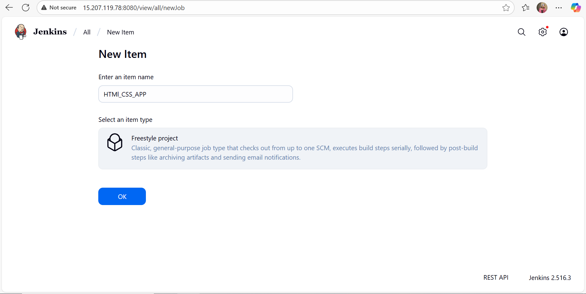
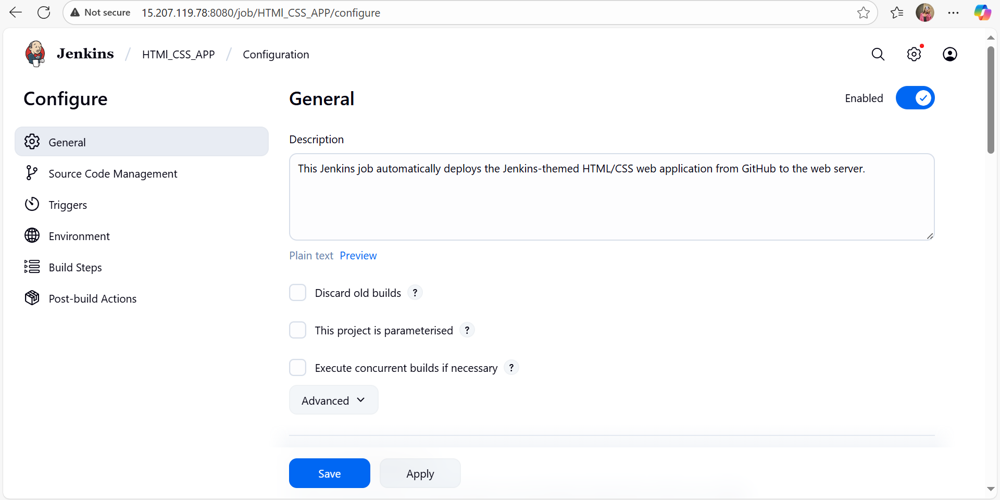
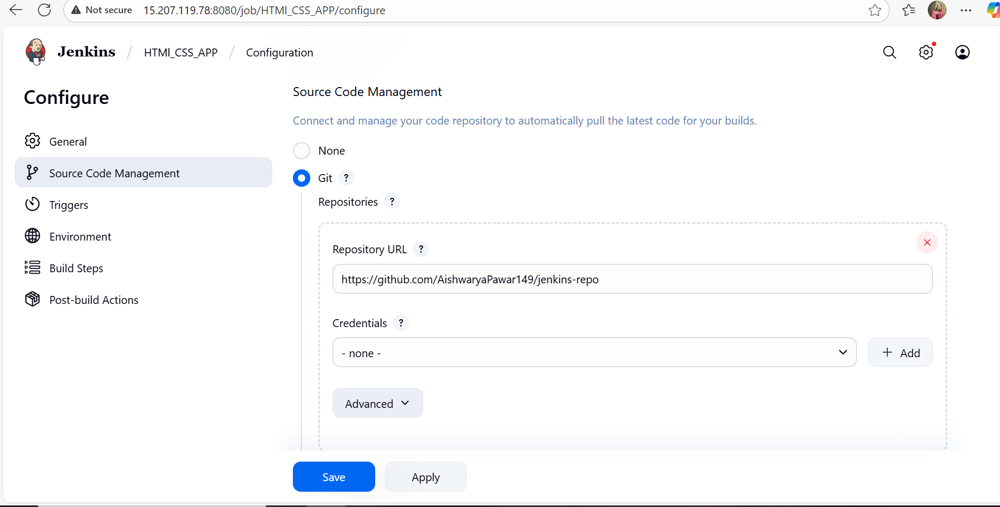
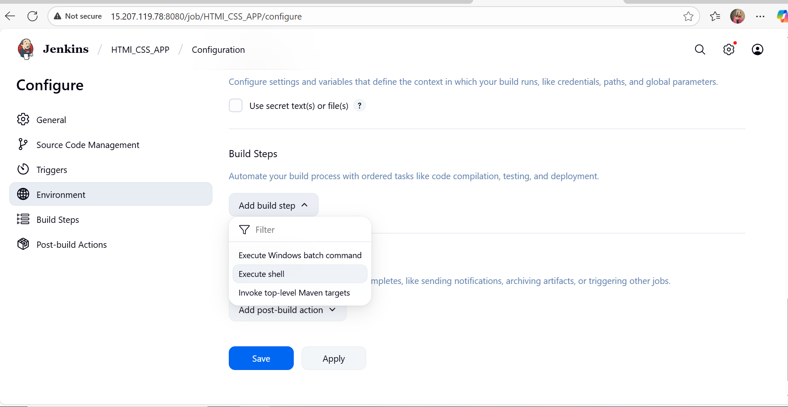
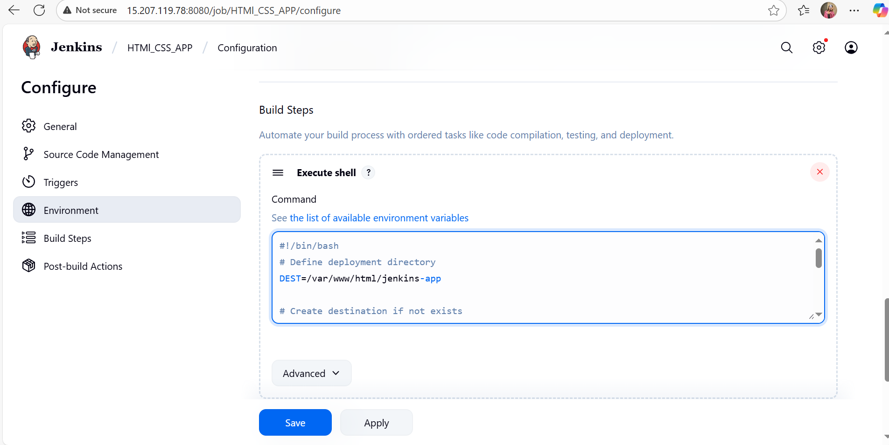
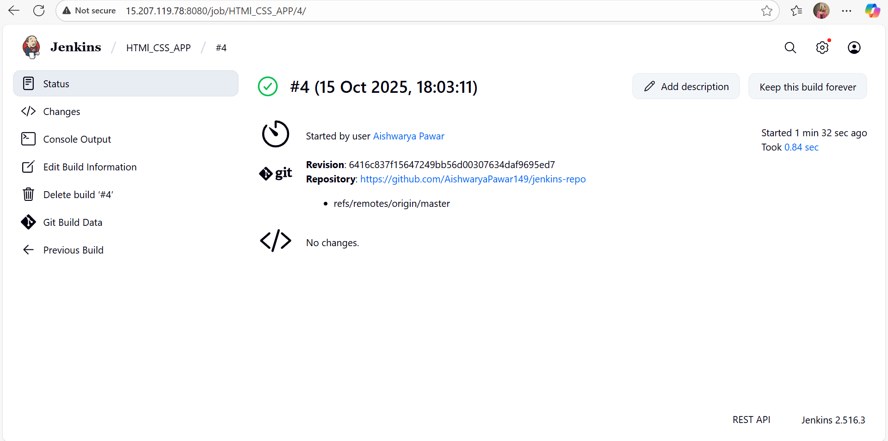
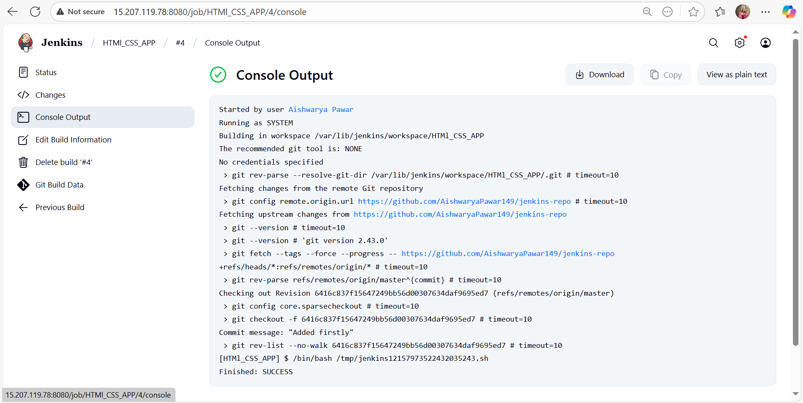
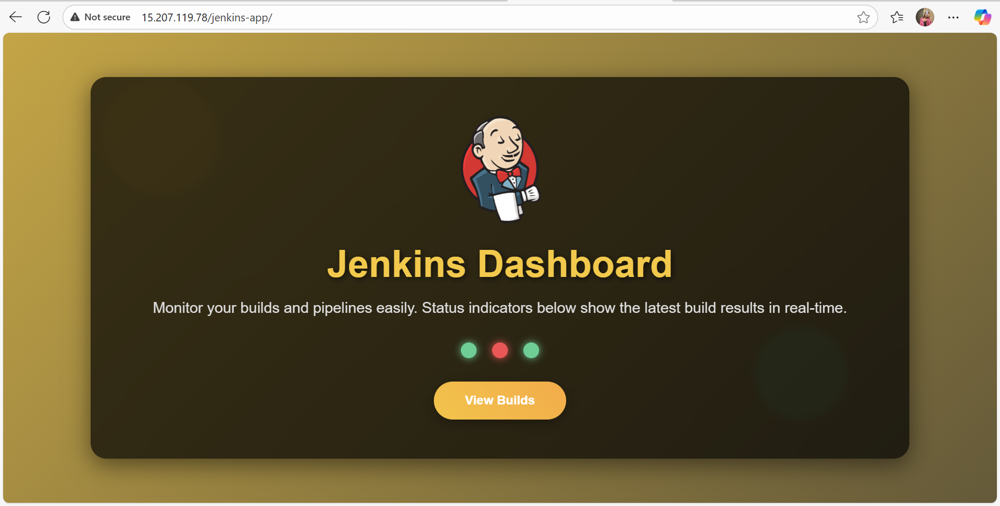

#  Jenkins Themed Web Dashboard

This project is a **Jenkins-themed animated HTML/CSS web app** that demonstrates how Jenkins can be used to deploy static websites through an automated CI/CD pipeline.

---

##  Project Overview

This web app includes:
- Clean, responsive **HTML5 + CSS3** design
- **Animated background** and **pulsing build status indicators**
- Jenkins color scheme (yellow, black, grey)
- Jenkins logo animation
- Example of **Jenkins automation pipeline**

---

##  Project Structure

```
jenkins-repo/
│
├── index.html              # Main HTML file with Jenkins dashboard UI
├── README.md              # Project documentation
│
└── assets/                # Screenshots and documentation images
    ├── add-build-step.png         # Jenkins build step configuration
    ├── add-commands.png           # Shell commands in Jenkins
    ├── add-githubrepo-url.png     # GitHub repository integration
    ├── build-status.png           # Build status indicators
    ├── console-output.png         # Jenkins console output
    ├── create-job.png             # Jenkins job creation
    ├── general-description.png    # General job description setup
    └── website-preview.png        # Final deployed website preview
```

---

##  Learning Objective

This project helps understand:
- How Jenkins can be used to pull code from GitHub
- How to automate deployment to a web server (e.g., Nginx)
- Basics of CI/CD pipelines for front-end projects

---

##  Deployment Steps

### 1️⃣ Prerequisites
- Ubuntu server with Jenkins installed
- Git installed and configured in Jenkins
- Nginx web server

#### Nginx Setup (If not installed)

**Install Nginx:**
```bash
sudo apt update
sudo apt install nginx -y
```

**Start and Enable Nginx:**
```bash
sudo systemctl start nginx
sudo systemctl enable nginx
```

**Verify Nginx Installation:**
```bash
sudo systemctl status nginx
```

**Configure Permissions:**
```bash
sudo chmod -R 755 /var/www/html
sudo chown -R $USER:$USER /var/www/html
```

**Test Nginx:**
Open browser and navigate to `http://<your-server-ip>` - you should see the Nginx welcome page.

### 2️⃣ Create Jenkins Job

#### Step 1: Create New Job
In Jenkins Dashboard → **New Item** → **Freestyle Project**



#### Step 2: Add Description
Add a meaningful description for your Jenkins job



#### Step 3: Configure Source Code Management
Add your GitHub repository URL under **Source Code Management**



#### Step 4: Add Build Step
Click on **Add build step** → **Execute shell**



#### Step 5: Add Shell Commands
```bash
#!/bin/bash
DEST=/var/www/html/jenkins-app
sudo mkdir -p $DEST
sudo rm -rf $DEST/*
sudo cp -r $WORKSPACE/* $DEST/
sudo systemctl restart nginx || echo "Nginx not installed, skipping restart"
```



### 3️⃣ Build & Deploy

Click **Build Now** in Jenkins



Check the **Console Output** to verify successful deployment



Your site will be live at:
```
http://<your-server-ip>/jenkins-app/
```

---

##  Preview

### Deployed Website


The deployed dashboard features:
- Animated Jenkins logo
- Pulsing build status indicators (Success, Building, Failed)
- Responsive design
- Modern Jenkins color theme

---

##  Technologies Used
- **HTML5**, **CSS3**
- **Jenkins CI/CD**
- **Nginx Web Server**
- **Git & GitHub**

---

##  Step-by-Step Screenshots

All configuration screenshots are available in the `assets/` folder:
- `create-job.png` - Creating a new Jenkins job
- `general-description.png` - Adding job description
- `add-githubrepo-url.png` - Configuring GitHub repository
- `add-build-step.png` - Adding build step
- `add-commands.png` - Shell script configuration
- `build-status.png` - Build execution status
- `console-output.png` - Console output logs
- `website-preview.png` - Final deployed website

---

##  Author
**Aishwarya Pawar**  


GitHub: [AishwaryaPawar149](https://github.com/AishwaryaPawar149)

LinkedIn: [AishwaryaPawar](https://www.linkedin.com/in/aishwarya-pawar149/)

---

##  Contributing
Feel free to fork this project, submit issues, or create pull requests to improve the documentation or add features!

---
